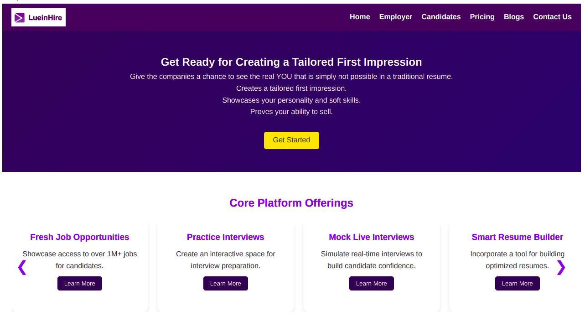

# LueinHire Candidate Page Redesign

## Objective
Redesign the LueinHire Candidate Page as a static, responsive webpage using HTML, CSS, and JavaScript. The goal is to create a clean, professional design with an engaging user experience.

## Features
- Fresh Job Opportunities: Access 1M+ job listings.
- Practice & Mock Interviews: Interactive tools for interview prep.
- Smart Resume Builder: Create optimized resumes.
- Curated Courses: Access 50,000+ free upskilling courses.
- Resume Review Service: Submit resumes for feedback.
- Placement Training: Comprehensive preparation program.
- Coding Challenges & Quizzes: Skill-building resources.
- Job Recommendations: Tailored suggestions.

## Technologies Used
- HTML: Structure
- CSS: Styling & responsiveness
- JavaScript: Interactivity

## Images
  
Screenshot showcasing the first feature.

  
Screenshot showcasing the second feature.

## Installation
1. Clone or download the repository:
   ```bash
   git clone https://github.com/SamX64/LueinHire_Frontend_Assignment.git
